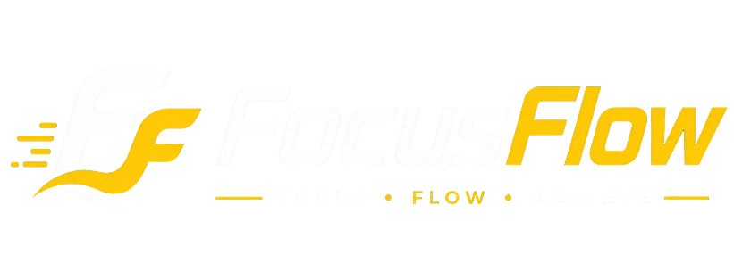

<div align="center">

  

# 🎯 FocusFlow

> **Deep work desktop app with Pomodoro timer, ambient sounds, Kanban board, and site blocker.**
>
> Created by **Abdelilah** ([@Abdelilah-dev](https://github.com/Abdelilah-dev))


---

## ✨ Features

| Feature | Description |
|---------|-------------|
| ⏱️ **Pomodoro Timer** | Customizable focus/break intervals to boost productivity |
| 🔊 **Ambient Sounds** | Built-in background sounds to help you stay in the zone |
| 📋 **Kanban Board** | Organize your tasks with a clean drag-and-drop board |
| 🚫 **Site Blocker** | Block distracting websites during focus sessions |
| 🌙 **Dark Theme** | Easy on the eyes for long work sessions |
| 🖥️ **Cross-Platform** | Available on **Windows** and **Linux** |

---

## 📦 Installation

### Windows

1. Download the latest release from the [Releases](https://github.com/Abdelilah-dev/FocusFlow/releases) page
2. Extract the ZIP file
3. Run `FocusFlow.exe`

Or install from source:

```bash
git clone https://github.com/Abdelilah-dev/FocusFlow.git
cd FocusFlow
pip install -r requirements.txt
python main.py
```

### Linux

#### Option 1: AUR (Arch Linux / Manjaro)

```bash
git clone https://github.com/Abdelilah-dev/FocusFlow.git
cd FocusFlow/focusflow-aur
makepkg -si
```

> **Note:** The AUR package configures `sudoers` and `polkit` rules automatically so the site blocker works without password prompts.

#### Option 2: Install from source

```bash
git clone https://github.com/Abdelilah-dev/FocusFlow.git
cd FocusFlow
pip install -r requirements.txt
python main.py
```

#### Option 3: Build the package manually

```bash
cd FocusFlow/focusflow-aur
rm -rf src *.pkg.tar.zst
makepkg -si
```

---

## 🛠️ Build from Source

### Prerequisites

- **Python** 3.8+
- **PySide6**
- **python-plyer**

```bash
# Install dependencies
pip install pyside6 python-plyer

# Clone the repo
git clone https://github.com/Abdelilah-dev/FocusFlow.git
cd FocusFlow

# Run the app
python main.py
```

---

## 🚀 Usage

1. **Launch FocusFlow**
2. **Add tasks** to your Kanban board
3. **Set your focus duration** (default: 25 min)
4. **Add distracting sites** to the block list (e.g., `youtube.com`, `twitter.com`)
5. **Hit "Focus"** and start your deep work session
6. The app will **automatically block** the listed sites during your session

### Site Blocker

The site blocker works by modifying your system's `/etc/hosts` file (Linux) or `hosts` file (Windows). It:

- Redirects blocked domains to `0.0.0.0` and `127.0.0.1`
- Disables DNS-over-HTTPS (DoH) in Chrome, Firefox, Brave, and Opera
- Flushes the DNS cache automatically
- Adds firewall rules to block DoH IPs

---

## 🏗️ Project Structure

```
FocusFlow/
├── assets/              # Icons, sounds, images
├── backend/             # Core logic (blocker, timer, sites)
├── frontend/            # UI components (PySide6)
├── focusflow-aur/       # Arch Linux PKGBUILD
│   ├── PKGBUILD
│   └── focusflow-sudoers
├── main.py              # Entry point
├── paths.py             # Path utilities
├── requirements.txt     # Python dependencies
└── README.md            # This file
```

---

## 🐧 Linux Permissions (Site Blocker)

On Linux, the site blocker requires elevated privileges to:
- Modify `/etc/hosts`
- Restart DNS services (`systemd-resolved`, `nscd`)
- Flush DNS caches
- Manage `iptables` rules

The AUR package handles this automatically by installing:
- A `sudoers` rule for `tee /etc/hosts`
- A `polkit` rule for `systemctl` and `resolvectl`

If installing from source, you may see authentication dialogs. To avoid them, add this to `/etc/sudoers.d/focusflow`:

```bash
%wheel ALL=(ALL) NOPASSWD: /usr/bin/tee /etc/hosts, /usr/bin/tee -a /etc/hosts, /usr/bin/systemctl restart systemd-resolved, /usr/bin/systemctl restart nscd, /usr/bin/resolvectl flush-caches, /usr/bin/iptables, /usr/bin/ip6tables, /usr/bin/iptables-save, /usr/bin/ip6tables-save
```

---

## 🛡️ Privacy & Security

- FocusFlow only modifies the `hosts` file during active focus sessions
- All blocked entries are tagged with `# FocusFlow` for easy cleanup
- The app creates a backup of your original `hosts` file before any changes
- No data is sent to external servers — everything stays local

---

## 📝 License

This project is licensed under the [MIT License](LICENSE).

---

## 👤 Author

**Abdelilah** — [@Abdelilah-dev](https://github.com/Abdelilah-dev)

---

## 🤝 Contributing

Contributions are welcome! Feel free to open issues or submit pull requests.

1. Fork the repository
2. Create your feature branch (`git checkout -b feature/amazing-feature`)
3. Commit your changes (`git commit -m 'Add amazing feature'`)
4. Push to the branch (`git push origin feature/amazing-feature`)
5. Open a Pull Request

---

## 🙏 Acknowledgments

- Built with [PySide6](https://doc.qt.io/qtforpython/)
- Inspired by the Pomodoro Technique

---

<p align="center">
  <b>Stay focused. Stay in flow. 🌊</b>
</p>
