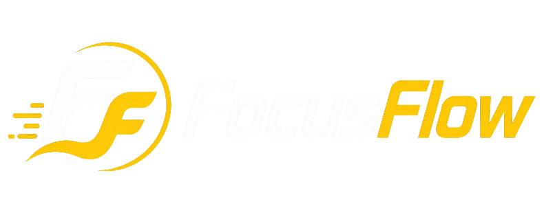

  

  # 🎯 FocusFlow

  **An all-in-one, high-performance desktop workspace built to help you maintain deep focus, manage workflow, and block distractions on Windows and Linux.**

  
  
  
  

   

  [📥 Download Installer](../../releases/latest) • [🐛 Report Bug](../../issues) • [⭐ Request Feature](../../issues)

---

## 🌟 Overview

**FocusFlow** is a sleek, cross-platform productivity application designed for developers, students, and power users. Built with a modern **Dark & Gold aesthetic**, it combines a **Pomodoro timer**, **ambient audio background**, a **Kanban task board**, and a **hard-blocking website tool** that works seamlessly on both **Windows** and **Linux**.

---

## ✨ Key Features

### ⏱️ Custom Focus & Break Timer
- **Flexible Intervals**: Easily configure and toggle between Focus and Break durations tailored to your workflow.
- **Audio & Visual Alerts**: Receive notification cues and audio alerts when completing focus sessions.
- **System Tray Support**: Runs smoothly in the background via the system tray without cluttering your desktop.

### 🚫 Advanced Site & Distraction Blocker
- **System-Level Blocking**: Redirects blocked domains directly to `0.0.0.0` inside system hosts files (`/etc/hosts` on Linux and `C:\Windows\System32\drivers\etc\hosts` on Windows).
- **Bypasses Encrypted DNS**: Forces sites to close even if browsers use Secure DNS / Encrypted DoH.
- **Active Session Termination**: Instantly closes active tabs navigating to blacklisted domains.
- **Instant Blacklist**: Enter a domain name and click **Add** to enforce instant restriction.

### 🎵 Ambient Soundscapes
- **4 High-Quality Audio Tracks**: Rain 🌧️, Wind 💨, Ocean 🌊, and Forest 🌲.
- **Smooth Audio Engine**: Features seamless **Fade-In & Fade-Out** audio transitions to prevent sharp sound interruptions.
- **Single-Track Focus**: Play one ambient environment at a time for maximum concentration.

### 📋 Interactive Kanban Task Board
- **4 Workflow Columns**: `TO DO`, `IN PROGRESS`, `DONE`, and `REFUSED`.
- **Progress Counter**: Dynamic task tracking showing completed items vs total tasks.
- **One-Click Clear**: Quickly reset your board for fresh daily sessions.

---

## 📸 Interface Preview

  

---

## 📥 Installation

### Option 1: Standalone Installer (Windows)
1. Navigate to the **[Releases](../../releases/latest)** section.
2. Download `FocusFlow_Setup.exe`.
3. Run the installer and launch **FocusFlow** directly from your Desktop!

---

## 🚀 Running from Source (Windows & Linux)

### Prerequisites
- **Python 3.10+**
- On Linux, ensure Qt multimedia plugins are installed (e.g., `qt6-multimedia-plugins` or `gstreamer`).

### Setup & Launch

1. **Clone the repository:**
   git clone https://github.com/Abdelilah-dev/FocusFlow.git
   cd FocusFlow

2. **Install dependencies:**
   pip install -r requirements.txt

3. **Run the Application:**

   - **On Linux** (root privileges required for site blocker):
     sudo python3 main.py

   - **On Windows** (run CMD/PowerShell as Administrator):
     python main.py

---

## 📜 License

Distributed under the **MIT License**. See [`LICENSE`](LICENSE) for more details.

---

  Crafted with ❤️ by <b>Abdelilah</b> for uninterrupted deep work.  
  <i>If FocusFlow helps your productivity, consider giving it a ⭐ on GitHub!</i>

